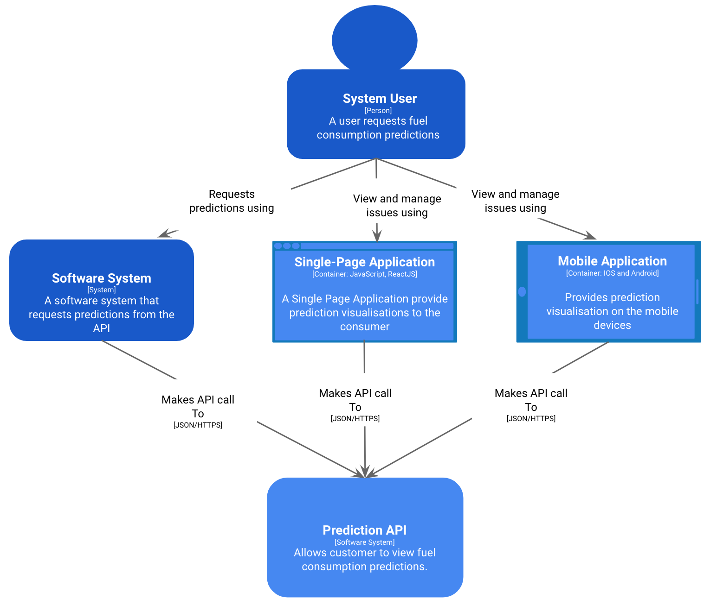
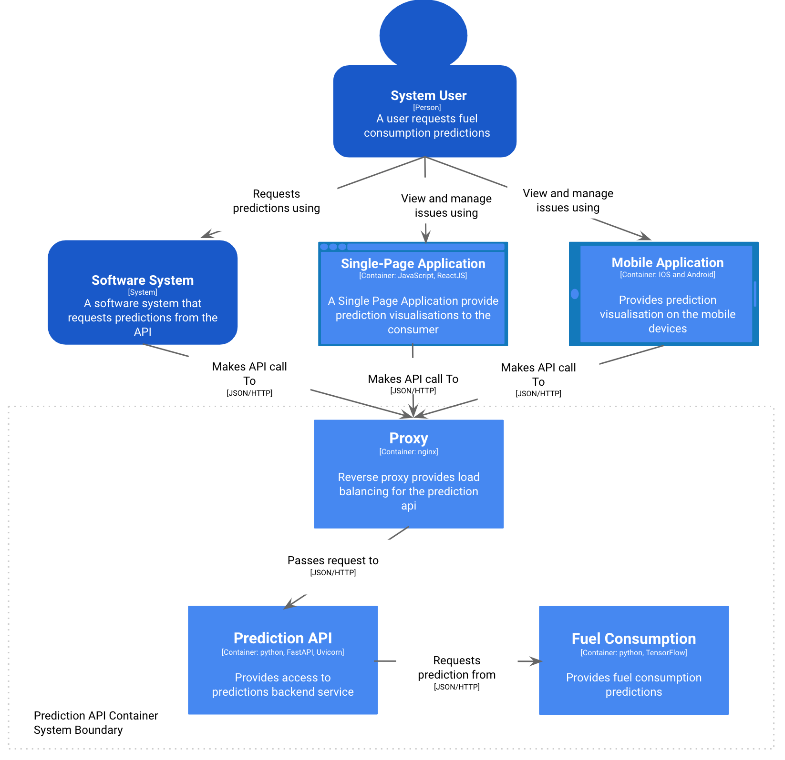

# Fuel Consumption prediction
This repository contains a simple fuel consumption machine learning model with an api to expose predictions
to consumer. The purpose of the repository is to demonstrate creating an api in a containerized environment
with tensorflow server.

The RESTful Api is developed using :-
* [Fast API](https://fastapi.tiangolo.com/)
* [Uvicorn](https://www.uvicorn.org/)
* [nginx](https://nginx.org/en/)
* [Pydantic](https://pydantic-docs.helpmanual.io/)
* [PyTest](https://docs.pytest.org/en/stable/)
* [Docker](https://www.docker.com/)
* [PyTest-cov](https://pypi.org/project/pytest-cov/)

## Architecture
It's a simple "prediction API" allows user to get fuel consumption predictions for a given data set. This is intentionally kept simple and basic. 

**Note:** API clients like Software System, Single Page Application and Mobile Applicaiton are not included in this code base. There are here to explain the context of predictions API as potential clients. However, the API provides documentation endpoint that include try out an api in the browser. please see "API Documentation" section below.

### System Context

<p align="center">
 
</p>

### API Container

The system consists of a reverse proxy, an API and Machine Learning backend system. A reverse proxy provides load balancing of request between multiple instances of an API. An API validates user input, trasform the user input to TensorFlow backend server format and requests predictions from the server.


<p align="center">
 
</p>

## Setup Environment
Install [Docker](https://www.docker.com/)

### Build and Run
Build the container instances using the following command:-

```
docker-compose up -d --build --remove-orphans
```
The above command will build the container before running it in a detached mode.

### Run Tests
The test are written and configured in containerized environment so that development environment or CI/CD pipelines can create, execute tests and destroy the containers.  
Run the following command to execute the tests:-

```
docker-compose exec prediction-api pytest .
```
### Check the Status of an API
Access the API using HTTP client of your choice like [Insomnia](https://insomnia.rest/) or [Postman](https://learning.postman.com/)

```
http://localhost:3000/status/
```
The above route show following response when API is running.

```
{
  "status": "ok"
}
```
### API Documentation
Please visit the following URL to view the documentation. The documentation is powered by [Swagger UI](https://swagger.io/tools/swagger-ui/):-

```
http://localhost:3000/docs
```
## Further Improvements
1. Handle exception elegantly when backend prediction model is down. For example: implement [exponential backoff](https://pypi.org/project/backoff/)
2. Add logging. This simple exercise doesn't include any logging that is key requirement for commercial software systems. 
3. Test quality can be improved by using testing api in isolation. Use of Fake, Stub or Mocks will isolate the prediction api from Tensorflow backend service in automated test environment.

